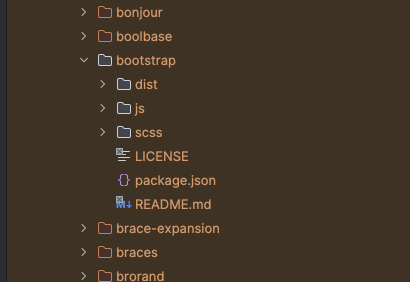

## Spring Annotations

* **@Controller**: We use @Controller annotation to make a java class as a Spring MVC contoller
* **@ResponseBody**:  The @ResponseBody annotation tells a controller that the object returned is automatically
  serialized into JSON and passed back into the HttpResponse Object
* **@RestController**: The @RestController is combination of @Controller and @ResponseBody
* **@PathVariable**: This used to handle when then client sends a request to server. In other words, it used on a method
  arugment to bind
  it to the value of a URI template variable
* **@RequestParam**: This is useful when we try to send a query to server
* **@RequestBody**: The @RequestBody annotation is responsible for retrieving the HTTP request body (JSON) and
  automatically
  converting it to the java object. This is used when we are using post method to create an object, whereas
  @Pathvariable is only retrieving a part of an object
* **@ResponseStatus**: This is give the header of HTTP status. For example @ResponseStatus(HttpStatus.Created) is giving
  HPPT 201 and
  @ResponseStatus(HttpStatus.Bad_Gateway) gives HTTP 502.
* **@RequestMapping**: This annotation is used in the class level to put the 'Base URI' for the controller
* **@Entity**: @Entity annotation specifies that the class is an entity
* **@PostMapping**: This annotation is used to map HTTP POST request onto specific handler method

### ResponseEntity

* ResponeEntity represents the whole HTTP response: status code, hearder, and body. As a result
  , we can use it to fully configure the HTTP response
* If we want to use it, we have to return it from the endpoint' Spring takes care of the rest
* ResponseEntity is a generic type. Consequently, we can use any type as response body.

## Spring Architecture

This Spring Boot Application Architecture.

POSTMan(client) <--> Controller Layer <--> Service Layer (Business Logics) <--> Repository Layer (Persistence) <---> DB

* I use JPA in Repository Layer to map the object to database tables
* I use DTO (Data Transfer Object) to map between the client and controller layer
* I should not use JPA instead of DTO because it may cause of security issue. Which means, the controller
  should not send and JPA to client.

### ModelMapper and MapStruct

These are two popular mappers to convert DTO objects to JPA objects without re-write the whole convertor manually.
The converting between JPA and DTO will be happened in Service Layer.

For ModelMapper I need to develop: (restful-webservice project DTO branch)

* Add ModelMapper Maven Dependency
* Configure ModelMapper class as Spring Bean
* Inject and use ModelMapper Spring bean in Service class

For MapSturct, I need to do these steps:

* use this dependencies

```
        <!-- https://mvnrepository.com/artifact/org.mapstruct/mapstruct -->
        <dependency>
            <groupId>org.mapstruct</groupId>
            <artifactId>mapstruct</artifactId>
            <version>1.6.2</version>
        </dependency>
        <!-- I need this repository to use MapStruct with Lombok -->
        <dependency>
            <groupId>org.projectlombok</groupId>
            <artifactId>lombok-mapstruct-binding</artifactId>
            <version>0.2.0</version>
        </dependency>
```

* use this plugin so maven can create the implementation
  file under target\generated-source\annotation automatically

```
    <properties>
        <java.version>17</java.version>
        <org.mapstruct.version>1.5.3.Final</org.mapstruct.version>
        <org.projectlombok.version>1.18.20</org.projectlombok.version>
        <lombok-mapstruct-binding.version>0.2.0</lombok-mapstruct-binding.version>
    </properties>
```

* Under plugins added :

```

            <!-- MapStruct annotation processor -->
           <plugin>
                <groupId>org.apache.maven.plugins</groupId>
                <artifactId>maven-compiler-plugin</artifactId>
                <version>3.8.1</version>
                <configuration>
                    <source>17</source>
                    <target>17</target>
                    <annotationProcessorPaths>
                        <path>
                            <groupId>org.mapstruct</groupId>
                            <artifactId>mapstruct-processor</artifactId>
                            <version>${org.mapstruct.version}</version>
                        </path>
                        <path>
                            <groupId>org.projectlombok</groupId>
                            <artifactId>lombok</artifactId>
                            <version>${org.projectlombok.version}</version>
                        </path>
                        <path>
                            <groupId>org.projectlombok</groupId>
                            <artifactId>lombok-mapstruct-binding</artifactId>
                            <version>${lombok-mapstruct-binding.version}</version>
                        </path>
                    </annotationProcessorPaths>
                </configuration>
            </plugin>
```

* create an interface with @Mapper annotation. example

```
@Mapper//(componentModel = MappingConstants.ComponentModel.SPRING)
public interface AutoUserMapper extends Converter<User , UserDto> {
    // I need to use this line for implementing the interface from the Mapper factory
    AutoUserMapper INSTANCE = Mappers.getMapper(AutoUserMapper.class);

    // if the fields are different name they have , I need to use @Mapping like this
    //@Mapping(source = "email", target= "emailAddress")
    UserDto mapToUserDto(User user);

    User mapToUser(UserDto userDto);
}
```

## Spring Bean Lifecycle

Instantiate --> Populate Properties --> Call setBeanName of BeanNameAware -->
Call setBeanFactory of BeanFactoryAware --> Call setApplicationContext of ApplicationContestAware --> Preinitialization (Bean PostProcessors) -->
afterPropertiesSet of Initializing Beans --> Custom Init Method --> Post Initialization (BeanPostProcessors) --> Bean ready to use


When the container is shutdown
Container Shutdown --> @PreDestroy annotated Method --> Disposable Bean's destroy() --> Terminated


* [Tutorials point](https://www.tutorialspoint.com/spring/spring_bean_life_cycle.htm)
* [Geeks For Geeks](https://www.geeksforgeeks.org/bean-life-cycle-in-java-spring/)

Spring has 14 'Aware' interfaces. These are can be useful when you want to modify Spring framework.

### Spring Bean Scope

* Singleton (default) - Only one instance of the bean is created in the IoC container
* Prototype - A new instance is created each time the bean is requested
* Request - A single instance per http request. Only valid in the context of the web-aware Spring ApplicationContext
* Session - A single instance per http session. Only valid in the context of the a web-aware Spring ApplicationContext
* Global Session - A single instance per global session. Typically only used in a portlet context. only valid in the
  context of a web-aware Spring ApplicationContext
* Application - bean is scoped to lifecycle of the ServletContext. only valid in the context of the web aware.
* Websocket - scope a single bean definition to the lifecycle of a webscoket . only valid in the context of a web-aware
  Spring ApplicationContext
* Custom Scope - Spring scope are extensible and you define your own scope by implementing spring 'scope' interface. You
  cannot override in the build in Singleton and Prototype Scope

#### Declaring Bean Scope

* No declaration needed for singleton scope
* in Java Configuration use @Scope annotation
* in XML configuration scope in an xml attribute of the bean tag
* 99% of the time singleton scope is fine

### Setting External Properties

* Command Line Arguments
* SPRING_APPLICATION_JSON
* JNDI
* OS Environment variables
* Property files / YAML (most comnon)

#### Property Hierarchy

- Review Section 24 - Externalized Configuration of Spring Boot
- Properties can be overridden depending on how they are defined
- Lowest are properties defined in JAR/WAR properties or YAML files
- NExt are external properties files to JAR via file system
- Higher are profile specific properties files (in jar then external)
- OS Environment Variables
- Java System properties
- JNDI
- SPRING_APPLICATION_JSON
- Command line argument
- Test Properties (for testing)

## JPA

- Hibernate 5 is complying with JPA 2.1

### JPA Cascade Type

By default, no operation are cascaded.

* PERSIST: Save operations will cascade to related entities
* MERGE: related entities are merged when the owning entity is merged
* REFRESH: related entities are refreshed when the owning entity is refreshed
* REMOVED: removes all related entities when the owning entity is deleted
* DETACH: detaches all related entities if a manual detach occurs
* ALL: Applies all the above cascade options

### Embeddable Type

* JPA/Hibernate do support an embeddable tpes and this is basically a POJO
* There are used to define a common set of propertie. e.g. an order might have a billing address and a shipping address
* An embeddable type could be used for the address properties.

#### Inheritance

Hibernate supports inheritance by using 'MappedSuperClass' . A database table is NOT created for the super class.

* Single Table: (Hibernate Default) - One table is used for all subclasses
* Joined Tables: Based class and subclasses have their own tables. Fetching subclass entities require a join to the
  parent table
* Table Per Class: Each subclass has its own table

#### Create and update Timpestamp

* Often a best practice to use create and update timestamps on your entities for audit proposes
* JPA supports @PrePersist and @PreUpdate which can be used to support audit timestamps via JPA lifecycle callbacks
* Hibernate provides @CreationTimestamp and @UpdateTimestamp (This is hibernate specific)

#### Hibernate DDL Auto

* DDL = Data Definition Language
* DML = Data Manipulation Language
* Camel naming will be changed with "_" . for example : UnitOfMeasure --> unit_of_measure
* Hibernate property in Spring is --> spring.jpa.hibernate.ddl-auto
* Option are none, validate, update, create, create-drop
* Default option for embedded db such as hsql, h2, derby is create-drop , otherwise, it will be 'none' as default.
* Data can be loaded from import.sql
  * This is hibernate not Spring feature
  * Must be on root of the class path
  * You may NEED to add spring.jpa.defer-datasource-initialization=true property into application.properties
* Only executed if hibernate's ddl-auto property is set to create or create-drop

#### Spring JDBC

* Spring's DataSource initializer via Spring Boot will be default load schema.sql and data.sql from the root of the
  classpath
* Spring Boot will also load from scheam-${platform}.sql and data-${platfor}.sql
  * Must set spring.datasource.platform property
* May conflict with Hibernate's DDL Auto property
  * Should use setting of 'none' or 'validate' 

# Testing In Spring

Pleas check 'RecetteProject' for different test style .
Also, in 'Gargamel Pet Clinic' you can fine the upgrading JUnit5

## Testing Terminology

* TDD - Test Driven Development - write test first, which will fail , then code to 'fix' test
* BDD - Behaviour Driven Development - Builds on TDD and specifies that tests of any unit of software should be
  specified in term of desired behaviour of the unit
* Mock - A face implementation of a class used for testing. Like a test double
* Spy - A partial mock, allowing you to override select methods of a real class

## Test Scope Dependencies

Using spring-boot-starter-test (default from Spring Initalizr will load the following dependenciese)

* JUnit - De-facto standard for unit testing java application
* Spring Test and Spring Boot Test - utilities and integration test support for Spring Boot applications
* AssertJ - A fluent assertion of matcher objects
* Hamcrest- A library fo matcher objects
* Mockito - A Java mocking framework
* JSONassert - An assertion library for JSON
* JSONPath - XPath for JSON

## JUnit 4 Annotation

| Annotation                            | Description                                                                                                                              |
|---------------------------------------|------------------------------------------------------------------------------------------------------------------------------------------|
| @Test                                 | Identiies a method as a test method                                                                                                      |
| @Before                               | Executed before each test. It is used to prepare  the test environment (e.g. read inputdata, initialize the class)                       |
| @After                                | Extecuted after each test. It is used to cleanup the test environment. It can also save memory by cleaning up expensive memory structure |
| @BeforeClass                          | Executed once, before the start of all tests. Methods marked with this annotation need to be defined as static to work with JUnit        |
| @AfterClass                           | Executed once, after all tests have been finished. Methos annotated with this annotation need to be defined as static to work with JUnit |
| @Ignore                               | Marchs that the test should be disabled                                                                                                  |
| @Test(expected =<br/> Exception.class | Fails if the method does not throw the named exception                                                                                   |
| @Test(timeout = 10)                   | Fails if the method takes longer than 10 milliseconds                                                                                    |

## Spring Boot Annotations

| Annotation                   | Description                                                             |
|------------------------------|-------------------------------------------------------------------------|
| @RunWith(SpringRunner.class) | Run test with Spring context                                            |
| @SpringBootTest              | Search for Spring Boot Application for configuration                    |
| @TestConfiguration           | Specify a Spring configuration for your test                            |
| @MockBean                    | Inject Mockito Mock                                                     |
| @SpyBean                     | Inject Mockito Spy                                                      |
| @JsonTest                    | Create a Jackson or Gson object mapper via Spring Boot                  |
| @WebMvcTest                  | Used to test web context w/o a full http server                         |
| @DataJpaTest                 | Used to test data layer with embedded database                          |
| @JdbcTest                    | Like @DataJpaTest, but does not configure entity manager                |
| @DataMongoTest               | Configures an embedded MongoDB for testing                              |
| @RestClientTest              | Creates a mock server for testing rest clients                          |
| @AutoConfigureRestDocks      | Allows you to use Spring Rest Docs in tests, creating API Documentation |
| @BootStrapWith               | Used to configure how the TestContext is bootstrapped                   |
| @ConextConfiguration         | Used to direct Spring how to configure the context for the test         |
| @ContextHierarchy            | Allows you to create a context hierarchy with @ConextConfiguration      |
| @ActiveProfile               | Set which Spring Profiles are active for the test                       |

## JUnit 5

| JUnit4       | Junit5      |
|--------------|-------------|
| @Before      | @BeforeEach |
| @After       | @AfterEach  |
| @BeforeClass | @BeforeAll  |
| @AfterClass  | @AfterAll   |
| @Ignore      | @Disabled   |
| @Catgory     | @Tag        |

Please note still you can run Junit 4 or 3 in Junit 5.
Junit 5 needs Java 8 or higher

# Data Binding in Spring

* Command Objects aka Backing Beans : Are used to transfer data to and from web forms
* Spring will automatically bind data of form posts
* Biding done by property name (less 'get'/ 'set')
* Example of a 'PersonBean'
  * 'firstNAme' would bind to property firstName
  * 'address.addressLine1' would bind to the addressLine1one of the address property of the PersonBean
  * email[0]/email[1] would bind to index zero and one of the email ist of Set property of Person

# Handling Exception in Spring framework

## HTTP Status Codes

* HTTP 5XX Server Error (e.g. HTTP 500 is Internal Server Error)
* Other 500 errors are generally not used with Spring MVC
* HTTP 4XX Client errors - Generally Checked exception
  * 400 Bad Request - cannot process due to client error
  * 401 Unauthorized - Authentication required
  * 404 Not found - Resource not found
  * 405 Method not allowed - HTTP method not allowed
  * 409 - conflict - Possible with simultaneous updates
  * 417 Expectation failed - Sometimes used with RESTful interfaces
  * 418 - I'm a teapot - April fools joke from IETS in 1998

## Spring for exception handling

When the Service layer throws an exception, we need to implements
Spring Boot Default Error Handling Response to prevent error HTTP 500. In order to do that,
we need to throw an ResourceNotFoundException whenever the error happens. The class ResourceNotFoundException
is the class which handle by GlobalExceptionHandler

### Exception Handling Steps

* Create and use **ResourceNotFoundException** custom exception. I extend the class from RuntimeException and
  I add @ResponseStatus(value = HttpStatus.NOT_FOUND) to the head of the class name
* Create **ErrorDetails** class to hold of the custom error response
* Create **GlobalExceptionHandler** class to handle specific and global exceptions. The **@ExceptionHandler** is an
  annotation to handle the specific exception and sending the custom responses to the client. example:
  ```@ExceptionHandler(UserNotFoundException.class)``` . also I need to add in the class level the annotation
  ``` @ControllerAdvice ```

### Exception Handling Annotation
* @ResponseStatus - Allow you to annotate custom exception classes to indicate to the framework the HTTP status you want
  retured when that exception is throw. It is 'global' to the application
* @ExceptionHandler - it works at the controller level and it allows you to define custom exception handling:
  * can be used with @ResponseStatus for just returning a http status
  * can be used to return a specific view
  * also can take total control and work with the model and view
    * 'Model' cannot be a parameter of an ExceptionHandler method
* HandlerExceptionResolver - it is an interface you can implement for custom exception handling
  * Used internally by Spring MVC
  * Note 'Model' is not passed
    * Example:
      public interface HandlerExceptionResolver {
      @Nullable
      ModelAndView resolveException( HttpServletRequest request,
      HttpServletResponse response, @Nullable Object handler, Exception ex );
      }
* Internal Spring MVC Exception Handlers
  * Spring MVC has 3 implementations of HandlerExceptionResolver
    * ExceptionHandlerExceptionResolver - matches uncaught exceptions to @ExceptionHandler
    * ResponseStatusExceptionResolver - looks for uncaught exceptions matching @ResponseStatus
    * DefaultHandlerExceptionResolver - Convert standard Spring Exception to HTTP status codes ( Internal to Spring MVC)
* Custom HandlerExceptionResolver
  * You can provide your own implementations of HandlerExceptionResolver
  * Typically implemented with Spring's Ordered Interface to define order the handlers with run in
  * Custom implementations are uncommon due to Spring robust exception handling
* SimplMappingExceptionResolver
  * A Spring Bean you can define to map exceptions to specific views
  * You only define the exception class name ( no package ) and the view name
  * You can optionally define a default error page

### Spring Boot Validation API

* In java, the java Bean Validation API has become the de-facto standard for handling. It is very easy because I just
  need to add ```spring-boot-starter-validation```
  validations in Java projects
* Hibernate Validator is the reference implementation of the validation API
  Important Bean Annotation
* @Null - check value is null
* __@NotNull__ - check values is not null
* @AssertTrue - value is true
* @AssertFalse - value is false
* __@Min__ - Number is equal or higher
* __@Max__ - Number is equal or less
* @DecimalMin - value is larger
* @DecimalMax - value is less than
* @Negative - values is less than zero - zero invalid
* @NegativeOrZero - values is less than zero or zero
* @Positvie - value is greater than zero , zero is invalid
* @PositiveOrZero - value is greater than zero or zero
* __@Size__ - checks if string or collection is between a min and max. It can be applied to String, Collection
  , Map and array operation
* @Digits - checks for integer digits and fraction digits
* @Past - checks if date is in past
* @PastOrPresent - checks if date is past or present
* @Future - checks if date is in future
* @FutureOrPresent - checks if date is present or in future
* @Pattern - checks against RegEx pattern
* __@NotEmpty__ - checks if value is not null nor empty (whitespace chars or empty collections).It can be
  applied to String, Collection, Map and array operation
* __@NonBlank__- checks string is not null nor whitespace character
* __@Email__ - checks if the string value is an email address

### Validation development steps

* Add Validation Dependency
* Add Validation Annotation to UserDto (to all Data Transition Object)
* Enable Validation using @Valid Annoation on Create and Update REST API (in controller class)
* Customize Validation Error Response and send back to client

### Which to use them

    * Depends on your specific needs
      * if just setting the HTTP status - use @ResponseStatus
      * if redirection to a view , use SimpleMappingExceptionResolver
      * if both , consider @ExceptionHandler on the controller

## Data Validation with JSR-303

### Hibernate validation constraints ( These specific for Hibernate and not bean validation)

* @ScriptAssert - class level annotation , check class against script
* @CreditCardNumber - verifies value is a credit card number
* @Currency - value currency amount
* @DurationMax - Duration less than given value
* @DurationMin - Duration greater than give value
* @EAN - Valud EAN Barcode
* @ISBN - valud ISBN Value
* @Length - String length b/w given min and max
* @CodePointLength - validates that code point length of the annotated char sequence is b/w min and max included
* @LuhnCheck - Luhn check sum
* @Mod10Check - Mod 10 check sum
* @Mod11Check - Mod 11 check sum
* @Range - check if number is b/w given min and max ( inclusive)
* @SafeHtml - check for safe HTML
* @UniqueElements - checks if collection has unique elements
* @Url - check for valid URL

## Internationalization

### Local Detection

* Default behaviour is to use Accept-language header
* Can be configured to use system, a cookie, or a custom parameter
* Custom Parameters is useful to allow user to select language

### Local Resolver

* AcceptHeaderLocalResolver is the Spring Boot Default
* Optionally can use FixedLocaleResolver ( uses the locale of the JVM)
* Available: CookieLocaleResolver, SessionLocaleResolver ( Not used much)

### Changing Locale

* Browsers are typically tied to the Locale of the OS
* Locale changing plugins are available
* Spring MVC provides as
  * LocaleChangeIntercepter to allow you to configure a custom parameter to use to change the locale.

### Resource Bundles

* Resource bundles (aks messages.properties) are selected on highest match order.
* First selected wil be on language region (ie: en-US would match messages_en_US.properties)
* If no exact match is found, just the language code is used
* en-GB would match message_en.properties
* OR if no file found, would match messages_en.properties
* Finally would match messages.properties

****

# Docker

### What is it?

* Docker is a standard for Linux containers. In other words, it is an engine that enables any payload to be encapsulated
  as a
  lightweight, portable, self-sufficient container that can be manipulated using standard operations and run
  consistently on virtually
  any hardware platform.
* A "Container" is an isolated runtime inside of Linux
* A "Container" provides a private machine like space under Linux
* Containers will run under any modern Linux Kernel

### Container can:

* Have their own process space
* Their own network interface
* 'Run' processes as root (inside of container)
* Have their own disk space (can share with host too)
* Container is NOT a VM (VM is using Hypervisor)

### Docker terminology

* Docker Image: ``` The representation of a Docker Constainer. Kind of like a JAR or WAR file in Java```
* Docker
  Container: ``` The standard runtime of Docker. Effectively a deployed and running Docker Image. Like a Spring Boot Executable JAR```
* Docker Engine: ``` The code which managees Docker stuff. Creates and runs Docker Containers```
* Docker Engin Runtime


### Docker Editions

For learning more
check [https://www.geeksforgeeks.org/docker-community-edition-vs-enterprise-edition/](https://www.geeksforgeeks.org/docker-community-edition-vs-enterprise-edition/)

#### Docker Enterprise

* CaaS (Container as a Service) platfor subscription
* Enterprise class support
* Quarterly Releases
* Backported patches for one year
* Certified Infrastructure

#### Docker Community

* Free Docker edition for developers and operations
* Monthly 'edge' release with the latest features for developers
* Quarterly releases for operations

#### Why two Docker Editions

* Docker has enjoyed explosive growth over the last several years
* The EE allows Docker of offer certified software and enterprise support
* This is important to companies with mission critical application
* It is important for regulatory compliance (PCI, SOX, SAS-70...)

#### Which Edition for Java Developer

* Functionally, the two editions are the same (Like CentOS vs Red Hat Enterprise Linux)
* Generally, Java developers should be fine using the Docker Community Edition
* Docker EE is not available on some commercial OS such as RHEL or SUSE

#### What is Docker Hub

* Docker hub is a public Docker Registry. It has a lots of images , so I can download them, when it is needed.
* Its address is [https://hub.docker.com](https://hub.docker.com)
* To download any image, I need to run in this way (This example is for MySql)
  ``` sudo docker pull mysql ```
* example of running mongo with exposed port ``` docker run --name my_mongo2 -p 27017:27017 -d mongo``` . In this
  example -p is exposing the tcp port
* another example is for
  mysql ``` sudo docker run --name mysql -v /usr/mysql_temp:/var/lib/mysql -e MYSQL_ALLOW_EMPTY_PASSWORD=yes -p 3306:3306 -d mysql:latest  ``` .
  for my own project I can
  run `` sudo  docker run -p 8081:8080 -d recette ``
* for stop the docker
  * run 'docker ps' to find out the container ID name
  * run 'docker stop [container_id_name]'
* for checking the log for any container

``` 
docker ps 
docker logs [container_id]
 ```

* To build an image using Docker file run: ``` docker build . -t <tag_nmae>``` . An
  example ` sudo docker build . -t recette -f recette.dockerfile `
* I can copy the file like ` scp -P 222 ./RecetteProjet-0.0.1-SNAPSHOT.jar USERNAME@192.168.XXX.XXX:/usr/docker/.  `
* In order to have a shell environment for the docker use ``` docker exec -it <container_name> bash```
* In order to use a volume in command line for docker ``` docker run -v <host_path>:<the_container_path> <image_name>```
* Sample of dockerfile (recette.dockerfile)

``` 
FROM openjdk:17-alpine

ADD RecetteProjet*.jar recette.jar
CMD java -jar recette.jar
```

#### Dockerizing Spring Boot Application

Spring Boot Application --> Docker file (using docker build and docker run) --> docker image --> using 'docker push' -->
docker hub

#### What is a Docker Image

* An image defines a Docker Container (Similar in concept to a snapshot of a VM or a class vs an instance of the class)
* Images are immutable. That means, once built, the files making up an image do not change
* Image are built in layers
* Each layer is an immutable file, but is a collection of files and directories
* Layers receive an ID, calculated via a SHA 256 hash of the layer contents
* Thus, if the layer contents change, the SHA 256 hash changes also.

### Image IDs

* image ids are a SHA 256 hash derived from the layers. Thus if the layers of the image changes, the SHA 256 hash
  changes
* The image ID listed by docker command (ie: docker images / docker images -q --no-trunc) is the first 12 characters of
  the hash

#### Image Tag names

* I can use image tag name
* the values of images are referred to by 'tag' names (this concept is very confusing at first)
* the format of the full tag name is ```[REGISTRYHOST/][USERNAME/]NAME:TAG```
  * REGISTERYHOST : registry.hub.docker.com
  * TAG: 'latest' is default
  * e.g registry.hub.docker.com/mongo:latest

#### How to use resistant storage

* when I want to run the docker I can use '-v [PATH]' (-v is for volume) to specify where docker can put the storage
  file there.
* example :

```
docker run --name my_mongo -v /user/temp:/data/db -d mongo:tag
```

In this example with add ':' , I change the path of real path to the one I want to give to mongo to used it. which
means, mongo understand the path as /data/db

### Docker House Cleaning

* There are three key areas of house keeping
  * Containers
  * images
  * volumes

#### Docker commands for house cleaning containers

* Kill all running docker containers
  ``` docker kill $(docker ps -q) ```
* Delete all Stopped Docker containers ```
  docker rm $(docker ps -a -q) ```
* Remove a dokcer image ```
  docker rmi \<image name\> ```
* delete untagged (dangling) images ```
  docker rmi $(docker images -q -f dangling=true) ```
  or
* ```docker rmi $(docker images --filter "dangling=true" -q --no-trunc)```
* Delete all images ```
  docker rmi $(docker images -q) ```

#### Docker commands for house cleaning volumes

* One a volume is no longer associated with a container it is considered as 'dangling'
* Remove all dangling volumes ```
  docker volume rm $(docker volume ls -f dangling=true -q)
  Note: This command does not remove files from host system in shared volumes ```
* Cheat
  sheet [docker-cheat-sheet-for-spring-devlopers](https://springframework.guru/docker-cheat-sheet-for-spring-devlopers/)

### Running Spring in Docker

* to run command ``` sudo docker run -v /usr/tmp:/usr/share/misc -d openjdk:17-alpine tail -f /dev/null``` to keep the
  centos up and running
* note that running command ` sudo docker ps` will not show the centos container in the list
* now if you run `sudo docker exec -it <image_name> sh` you can inside of alpine with java 17 and run any application
  you want.
* for example I can run `java -version`

# MySQL

* It is RDBMS database which has ACID compliance
  * A: Atomicity - all or nothing
  * C: Consistency - transactions are valid to rules of the DB
  * I: Isolation - Result of transactions are as if they are done end to end
  * D: Durability - Once a transaction is commited, it remain so

## Features

* Stored Procedure
* Triggers
* Cursors
* Updatable views
* Query Caching
* Subselects

## DataType

MySql does not support standard ANSI SQL for data type
Data Type categories in MySQL:

* Numeric Data Types
  * INTEGER/INT (4b)
  * TINYINT (1b)
  * SMALLINT (2b)
  * MEDIUMINT (3b)
  * BIGINT (8b)
  * FLOAT (4b)
  * DOUBLE (8b)
  * DECIMAL/NUMERIC (Length + 1 or 2 bytes)
* Date and Time Data Types
  * DATE (3b)
  * DATETIME (8b)
  * TIMESTAMP (4b)
  * TIME (3b)
  * YEAR (1b)
* String Data Types
  * CHAR - Length (0 - 255 bytes) - (DB will pad spaces to the end of the string)
  * VARCHAR - Length +1 - variable string
  * BINARY - Length - Similar to CHAR
  * VARBINARY - Length +1
  * BLOB - Length + 2 to 4 bytes
  * TEXT - Length + 2
  * ENUM (1-2 bytes)
  * SET (1-8 bytes)
* Spatial Data Types
* JSON Data Types (JavaScript Object Notation)
  * This is complex, structured document containing properties and values
  * Storage for JSON data types is similar to BLOB and TEXT data types.
  * MySQL converts the JSON to an internal format for optimized storage and searching
  * MySQL support searching of JSON document properties
  * MySQL allows you to update portions of a JSON document(no replace needed)

## Types of connections

* Local Connection - This is when you are using command line on the machine running MySQL
* Remote/Client Connection - You are using some type of client software on the same machine
  OR connect to the MySQL Server from different machine over the network
  Client Protocol
  * TCP/IP - Most common
  * Socket (Unix/OSX/Linux)
  * PIPE (Windows Only)
  * MEMORY (Windows Only)

# MongoDB

* MongoDB is a document oriented database
* It is a NOSQL database written with C++
* MongoDB documents are storted in BSON (Binary JSON)

#### Why to use MongoDB

* MongoDB is greate for high insert systems (sensor reading, social media, advertising systems)
* Good when you need schema flexibility
* It can also support a high number of reads pe second

#### Why not to use MongoDB

* MongoDB has no concept of transactions
  * No ACID
  * No locking for transactional support, hence faster inserts
* Not good for concurrent updates
* if you have RDMS and want to change to NoSQL, no bi-directional relationship works anymore.

### MongoDB Terminology

| RDMS        | MongoDB              |
|-------------|----------------------|
| Database    | Database             |
| Table       | Collection           |
| Row         | Document             |
| Column      | Field                |
| Table Join  | Embedded Documents   |
| Primary Key | Primary Key          |
| Aggregation | Aggregation Pipeline |

# Spring Reactive Programming

* [www.reactivemanifesto.org](www.reactivemanifesto.org)
* Reactive System from architecture and design (cloud Native)
* Reactive Programming is generally event based
* Functional Reactive programming (FRP) often confused with Reactive Programming

## Reactive Manifesto

* Responsive
* Elastic
* Resilient
* Message Driven

## Reactive Programming w/ Reactive Systems

* Reactive Programming is a useful implementation technique
* Reactive Programming focuses on non-blocking, asynchronous execution - a key characteristic of Reactive Systems
* Reactive Programming is just one tool in building Reactive Systems

## What is Reactive Programming

* It is an asynchronous programming paradigm focused on streams of data
* Reactive Programming focuses on processing streams of data
* Traditional CRUD applications are still alive and well
* it also maintain a continous interaction with their environment , but at a speed which is determined by the
  environment, not the program itself.
* it is interactive programs work at their own pace and mostly deal with communication, while reactive programing only
  work in response to external demands and mostly deal with accurate interrupt handling.
* SpringMVC (@Controller / @RequestMapping) and Spring WebFlux(Router Functions) are completely two different component
  in Spring framework
* Real-time programs are usually are reactive
* Common use cases
  * external service calls
  * high concurrent message consumers
  * spreadsheets
  * abstraction over asynchronous processing

### Features of Reactive Programming

* Data Streams
  * It can be just about anything
  * mouse click or other user interactions
  * JMS messages , RESTful Services calls, Twitter feed, Stock Trades, List of data from a database
  * A Stream is a squence of events ordered in time
  * Event you want to listen to
* Asynchronous
  * Events are captured asynchronously
  * A function is defined to execute when an event is emitted
  * Another function is defined if an error is emitted
  * Another function is defined when complete is emitted
* Non-blocking
  * It is similar to GoF Observer Pattern
  * It is an important feature (act similar to Node.js)
  * In Blocking, the code will stop and wait for more data (ie reading from disk , network, ...)
  * Non-Blocking in contrast, will process available data, ask to be notified when more is available, then continue
* Backpressure
  * The ability of the subscriber to throttle data
* Failures as Messages
  * Exceptions are not thrown in a traditional sense(would break processing of stream)
  * Exceptions are processed by a handler function

### Spring Reactive Types

* Two new reactive types are introduced with Spring Framework 5
* 'Mono' is a publisher with zero or one elements in data stream
* 'Flux' is a publisher with zero or MANY elements in the data stream
* Both types implement the Reactive Streams Publisher interface

#RESTful Services

## RESTful Web Services

* Because of their simplicity and versatility, RESTful web serves have become the de facto standard for web services
* REST - Representational State Transfer
  * Representational -- Typical JSON or XML
  * State Transfer - Typical via HTTP

## RESTful Terminology

* Verbs: HTTP Methods : GET, POST, DELETE, PUT
* Messages: the payload of the action (JSON/XML)
* URI: Uniform Resource Identifier (A unique string identifying a resource)
* URL: Uniform Resource Locator (A URI with network information e.g. http://www.gforcesoftware.ca)
* Idempotence:
  * Wikipedia: Idempotence is the property of certain operations in mathematics and computer science that they can be
    applied multiple times w/o changing the result beyond the initial application
  * In other words, you can exercise the operation multiple times, without changing the result
  * Example: Refreshing a web page (HTTP GET operation)
* Stateless - Service does not maintain any client state
* HATEOAS: Hypermedia AS The Engine Of Applications State
  * Wikipedia: a REST client should then be able to use server-provided links dynamically to discover all the available
    actions and resources it needs.
    . As access proceeds, the server responds with test that includes hyperlinks to other actions that are currently
    available.

### HTTP GET

* use: to read data from resource
* read only
* idempotent
* state operation - does not change state of resource

| Methode | USE                              | Safe<br/>Operation | Read<br/>Only | Idempotent |
|---------|----------------------------------|--------------------|---------------|------------|
| GET     | read data from resource          | Yes                | Yes           | Yes        |
| PUT     | to insert or update              | No                 | No            | Yes        |
| POST    | Always create new object(Insert) | No                 | No            | No         |
| DELETE  | to delete an object in resource  | No                 | No            | Yes        |

## Richardson Maturity Model (RMM)

* A model used to describe the maturity of RESTful services
* Unlike SOAP there is no formal specification for REST
* RMM is used to describe the quality of the RESTful service

### RMM Levels

```
| Level 3: Hybermedia Control  |
| Level 2: HTTP Verbs          |
| Level 1: Resources           |
| Level 0: The swap of POX     |
```

#### Level 0 - Swamp of POX

* POX - Plain Old XML
* uses implementation protocol as a transport protocol
* typically uses one URI and one kind of method
* Examples RPC, SOAP, XML-RPC

#### Level 1- Resources

* Uses multiple URIs to identify specific resources
* Still uses a single method (e.g GET)
* Example:
  * http://www.gforcesofteare.ca/product/1234

#### Level 2 - HTTP Verbs

* HTTP Verbs are used with URIs for desired actions
* Most common in practical use
* Example:
  * GET /products/1234 - to return data for product 1234
  * PUT /products/1234 - to update data for product 1234
  * DELETE /product/1234 - to delete product 1234

#### Level 3- Hypermedia Control

* Representation now contains URIs which may be useful to consumers (self documenting)
* Helps client developers expolore the resource
* No clear standard at this time
* Spring provides an implementation of HATEOAS

| **Core Technolog** |
|--------------------|
| HYPERMEDIA         |
| HTTP               |
| URI                |

#### Data Model

* Spring by default use Jackson to bind JSON to Java POJOs

# Kafka

Apache Kafka is an open-source distributed event streaming platform used by many companies for high performance data
pipeline
, streaming analytics, data integration, and mission-critical applications.

### Cluster

Since Kafka is a distributed system, it acts as a cluster. A Kafka Cluster consists of a set of broker.
It is container of Kafka Broker. Each cluster has to keep minimum three brokers.

### Broker

It is basically Kafka Server. It's jsut a meaningful name given to the Kafka server and this name makes sense as well
because all that Kafka does is act as a message broker b/c producer and consumer. The producer and consumer do not
interact directly. They use Kafka server as an agent or
a broker to change message

### Producer

Producer is an application that sends messages. It does not send messages directly to the recipient. It sends messages
only to the Kafka server. The most field is `private final KafkaTemplate<String, User> kafkaTemplate;` in orddeer
to send the message to Kafka. and I use to send the message.

Note: the sample JSON message (e.g. User class )should be like this

```java 
        Message<User> message = MessageBuilder
        .withPayload(user)
        .setHeader(KafkaHeaders.TOPIC, topicName)
        .build();
```

If you are just using a string to send to Kafka the send message is very simple

```java

kafkaTemplate.send(topic, message);
```

### Consumer

Consumer is an application that reads messages from the Kafka server. If producers are sending data, they must be
sending it to someone, right? The consumer are the
recipients. but remember that the producers don't send data to a recipient directly. They just send to Kafka server. and
anyone who is interested in the data can come forward and take it from
Kafka server. So, any application that requests data from a Kafka server is a consumer, and they can ask for data sent
by any producer provided they have permission to read it.
I need to use this annotation `    @KafkaListener(topics =  "${spring.kafka.topic-json.name}", groupId = "gForceGroup")`
to define my method listener as consumer.

### Kafka Topic

Topic is for identification mechanism to request data from a broker. There commes the notion of the topic

* Topic is like a table in database or folder in a file system
* Topic is identified by a name
* You can have any number of Topics

### Kafka Partitions

Kafka topics are divided into a number of partitions, which is contain records in an unchangeable sequence.
Kafka broker will store messages for a topic, but the capacity of data can be enormous and it may not be possible to
store
in a single computer. Therefore, it will paritioned into multiple parts and distributed among multiple computers, since
Kafka is a distributed system.

Several portions --> one topic

Several topics --> one broker

Several brokers --> one cluster

### Offsets

Offsets is a sequence of ids given to messages as the arrive at a partition. Once the offset is assigned
it will never be changed. The first message gets an offset zero, The next message receives an offset
one and so on.

### Consumer Group

A consumer group contains one or more consumers working together to process the messages.
I need to define it bye `spring.kafka.consumer.group-id=gForceGroup` and it is one par to Kafka listener

### Zookeeper

It is managing all brokers in the cluster and all push and pull messages to the cluster.

### Spring for Kafka

[https://docs.spring.io/spring-kafka/reference/quick-tour.html](https://docs.spring.io/spring-kafka/reference/quick-tour.html)

#### How to Set up Kafka in Spring

```properties
#Kafka Consumer Set up
spring.kafka.consumer.bootstrap-servers=192.168.23.47:9092
spring.kafka.consumer.group-id=gForceGroup
spring.kafka.consumer.auto-offset-reset=earliest
spring.kafka.consumer.key-deserializer=org.apache.kafka.common.serialization.StringDeserializer
spring.kafka.consumer.value-deserializer=org.apache.kafka.common.serialization.StringDeserializer
spring.kafka.consumer.properties.spring.json.trusted.packages=*

#Kafka Producer Setup
spring.kafka.producer.bootstrap-servers=192.168.23.47:9092
spring.kafka.producer.key-serializer=org.apache.kafka.common.serialization.StringDeserializer
spring.kafka.producer.value-serializer=org.apache.kafka.common.serialization.StringDeserializer
```

This `spring.kafka.consumer.properties.spring.json.trusted.packages=*` means, spring application will accept and trust
all message in JSON spring

### How to Run Kafka in Docker

* Use this YAML file with name docker-compose.yml (IP address has to change in plain text host line)

```yaml
services:
  zookeeper:
    image: confluentinc/cp-zookeeper:latest
    environment:
      ZOOKEEPER_CLIENT_PORT: 2181
      ZOOKEEPER_TICK_TIME: 2000
    ports:
      - 22181:2181
  
  kafka:
    image: confluentinc/cp-kafka:latest
    depends_on:
      - zookeeper
    ports:
      - 29092:29092
    environment:
      KAFKA_BROKER_ID: 1
      KAFKA_ZOOKEEPER_CONNECT: zookeeper:2181
      KAFKA_ADVERTISED_LISTENERS: PLAINTEXT://kafka:9092,PLAINTEXT_HOST://192.168.23.47:29092
      KAFKA_LISTENER_SECURITY_PROTOCOL_MAP: PLAINTEXT:PLAINTEXT,PLAINTEXT_HOST:PLAINTEXT
      KAFKA_INTER_BROKER_LISTENER_NAME: PLAINTEXT
      KAFKA_OFFSETS_TOPIC_REPLICATION_FACTOR: 1

```

* run the docker as this command (with space rather than '-')
  ``` sudo docker compose up -d```

* To shutdown you run this command ```sudo docker compose down```

## Serialization and Deserializatin JSON on Kafka

### How to send and receive a Java Object as a JSON byte [] to and from Apache Kafka

Apache Kafka stores and transports byte[] . There are number of built-in serializer and deserializer but
it does't include any for JSON. Spring Kafka created a JsonSerializer and JsonDeserializer which we can use to
convert Java Object to and from JSON.

We'll send a Java object as JSON byte[] to a Kafka topic using a `JsonSerializer`. After that, we'll configure how to
receive a JSON byte[] and automatically convert it to a Java Object using a `JsonDeserializer`.
I don't need to change the key deserializaer, but I need to change the value of deserializer to
`spring.kafka.consumer.value-deserializer= org.springframework.kafka.support.serializer.JsonDeserializer` and in
producer
to `spring.kafka.producer.value-serializer=org.springframework.kafka.support.serializer.JsonSerializer`
These are availabe only in Spring boot, otherwise, I need to implment different Bean in my application

## Spring Boot Actuator

* Spring Boot Actuator module provides production-ready feature such as monitoring , metrics and health checks
* The Spring Boot Actuator enables you to monitor the application using HTTP endpoints and JMX.
* Spring Boot provides a spring-boot-starter-actuator library to aut-configure Actuator
* the property `management.endpoints.web.exposure.include=*` is added to application.properties file under resources

### /info Endpoint

* If you added any information about the application in application.properties then we can view it using /info endpoint
* For info we need to add `management.info.env.enabled=true` to the application.property file also
* I need to add some info in application.properties file . after 'info' you can add anything you like

```properties
info.app.name= Spring Boot Restful Web Service
info.app.description = Spring Boot Restful Web Services Demo
info.app.version=1.0.0
```

### /health Endpoint

* The /health endpoing shows the health o the application, including the disk space , database and more.
* In order to see more information other than the status of the application, I need to add
  `management.endpoint.health.show-details=always` to application.property file, and the result would be like this

```yaml
{
  "status": "UP",
  "components": {
    "db": {
      "status": "UP",
      "details": {
        "database": "MySQL",
        "validationQuery": "isValid()"
      }
    },
    "diskSpace": {
      "status": "UP",
      "details": {
        "total": 1000284,
        "free": 5900544,
        "threshold": 1760,
        "path": "/gitApplication/restful-webservice/.",
        "exists": true
      }
    },
    "ping": {
      "status": "UP"
    }
  }
}
```

### /beans Endpoint

* The /beans endpoint shows all the beans registered in your application, including the beans you explicitly
  configured and those auto configured by Spring Boot

### /conditions Endpoint

* The /conditions endpoint shows the auto configuration report, categoriesd into positiveMatches and negativeMatches

### /mappings Endpoint

* The /mappings endpoint shows all the @RequestMapping paths declared in the application
* This is very helpful for checking which request path willl be handled by which controller method

### /configprops Endpoint

* The /configprops endpoint offers all the configuration properties defined by @ConfigurationProperties bean,
  including your configuration properties defined in the application.properties or YAML file.
* make sure you add

```
management.endpoint.env.show-values=always
management.endpoint.configprops.show-values=always
```

into application.properties file, in order to see all value; otherwise, you see many stars instead of actual values.
Note that, by enabling them you expose much sensitive information, so you need to keep them usually disable or change it
to 'when_authorized' option

### /metrics Endpoint

* The /metrics endpoint shows various metrics about the current application such as how much memory it is using,
  how much memory is free, the size of the heap is used, and the number of threads used, and so on.
* when you use this endpoint it will show all name of option you can use with metrics endpoint. you just need
  to add the name of the metrics after /acturator/metrics. For example,
  `http://localhost:8080/actuator/metrics/jvm.info` will show the java version the application is running

### /env Endpoint

* The /env endpoint exposes all the properties from the Spring's __ConfigurableEnvironment__ interface, such as
  a list of active profiles, application properties, system environment variables and so on.

### /threaddump Endpoint

* Using this endpoint, you can view your application's thread dump with running threads details and JVS stack trace.

### /loggers Endpoint

* The /loggers endpoint allows you to view and configure the log level of your application at runtime.
* You can view the logging level of the specific logger `http://localhost:8080/actuator/loggers/{name}`.
  For example `http://localhost:8080/actuator/loggers/org.springframework.web.util` or
  `http://localhost:8080/actuator/loggers/ca.gforcesoftware.restfulwebservice`
* By using specific logger, I can 'POST' the logger and change the log level to what I want. For example

```
POST http://localhost:8080/actuator/loggers/ca.gforcesoftware.restfulwebservice
Content-Type: application/json

{
  "configuredLevel": "DEBUG"
}

```

Then result will be like this command `GET http://localhost:8080/actuator/loggers/ca.gforcesoftware.restfulwebservice`

``` 
HTTP/1.1 200 
Content-Disposition: inline;filename=f.txt
Content-Type: application/vnd.spring-boot.actuator.v3+json
Transfer-Encoding: chunked
Date: Fri, 15 Nov 2024 17:19:35 GMT

{
  "configuredLevel": "DEBUG",
  "effectiveLevel": "DEBUG"
}
```

### /shutdown Endpoint

* The /shutdown endpoint can be used to gracefully shutdown the application
* This endpoint not enabled by default, You can enable this endpoint by adding
  `management.endpoint.shutdown.enabled=true` to application.properties
* After adding this property, we need to send the HTTP POST request in order to run it.

``` 
POST http://localhost:8080/actuator/shutdown 
```

The result it

``` 
HTTP/1.1 200 
Content-Type: application/vnd.spring-boot.actuator.v3+json
Transfer-Encoding: chunked
Date: Fri, 15 Nov 2024 17:25:45 GMT

{
  "message": "Shutting down, bye..."
}
```

## SpringDoc

* __springdoc-openapi__ java library helps to automate the genration of API documentation using Spring Boot projects
* __springdoc-openapi__ java library provides integration between spring-boot and swagger-ui. Automatically generates
  documentation in JSON/YMAL and HTML format APIs.
* This library support
  * OpenAPI 3
  * Spring-boot v3 (JAva 17+)
  * JSR-303 specifically for @NotNull, @Min, @Max and @Size (validation tags)
  * Swagger-ui
  * OAuth 2
* This a community-based project, not maintained by the spring framework contributions

### Development Steps

## SpringDoc OpenAPI

### Development Steps

1. Adding springdoc-openapi Maven dependency

```xml
<!-- https://mvnrepository.com/artifact/org.springdoc/springdoc-openapi-starter-webmvc-ui -->
<dependency>
  <groupId>org.springdoc</groupId>
  <artifactId>springdoc-openapi-starter-webmvc-ui</artifactId>
  <version>2.7.0</version>
</dependency>
        <!-- SpringDoc OpenAPI dependency -->
<dependency>
<groupId>org.springdoc</groupId>
<artifactId>springdoc-openapi-ui</artifactId>
<version>1.6.14</version> <!-- Ensure you have the correct version -->
</dependency>
```

The second dependency should be there otherwise, I will get an error.
I will have access using /swagger-ui/index.html `http://localhost:8080/swagger-ui/index.html`

2. Defining General API information (Using Annotation)
   In Application class file (main class), I add this

```java
@OpenAPIDefinition(
        info = @Info(
                title = "Gargamel Spring Boot Doc",
                description = "Gargamel Spring Boot Doc Description",
                version = "v1.0",
                contact = @Contact(
                        name = "Gavin",
                        email = "Gavin.Hashemi@GForceSoftware.ca",
                        url = "https://www.linkedin.com/in/ghobadh/"

                ),
                license = @License(
                        name = "Apache 2.0",
                        url = "https://www.linkedin.com/in/ghobadh/"
                )

        ),
        externalDocs = @ExternalDocumentation(
                description = "Spring Boot User Management Documentation",
                url = "http://localhost:8080/Users"
        )
) 
```

3. Customizing Swagger API Documentation with annotations
   In controller class level I add @Tag

```java
@Tag(
        name = "CRUD REST APIs for User Resource",
        description = "CRUD REST APIs for User Resource for Create User, Modify User, Delete User and Get All Users"
) 
```

in method level, I need to add these tages

```java 
    @Operation(
            summary = "Update User  data REST API",
            description = "Get all User RESTful API is used to get the user from MySQL"

    )
    @ApiResponses( value = {
            @ApiResponse(responseCode = "20", description = "HTTP Status 200 get the all user info")
    } )
```

4. Customizing Swagger Model Documentation with annotations
  in DTO class level. For example in UserDto.java

```java  
@Schema(
        description = "UserDto Model Information"
)
```

In above each field of DTO class, I add this to describe the schema of the class

```java 
    @Schema(
            description = "User email"
    )
```

# Record Class in Java

* Java Record is a special kind of clas that helps you encapsulate related data w/o the need for boilerplate code
* Using a Record class as a DTO (Data Transfer Object) in a Spring Boot application is a modern and efficient approach
  to encapsulating data transfer b/w the appliation layers
* Records are a good fit for DTOs because they are concise, immutable and automatically provide implementation of
  * getter() ,
  * constructor,
  * equal() ,
  * hashCode(), and
  * toString()

  methods, which are essential for DTOs

__NOTE__
record cannot work with ModelMapper for converting in DTO, but it is fine with Mapstruct converting.
please check springboot_microservice repository with master_employee branch.

# Microservices

Microservices architecture enables large teams to build scalable applications that composed of many
loosely coupled services

Each microservice:

* can have its own database
* can expose the REST APIs
* are loosely coupled
* should be developed independently
* should be deployed independently
* should be scaled independently

Type of communications in among microservice servers

* Synchronized: we can have the HTTP protocol to make an HTTP request from one microservice to the microservice
  1. The client sends a request and waits for a response from the servie
  2. The important point here is that the protocol(HTTP/HTTPS) is synchronous and the client code can only continue
     its task when it receives the HTTP server response.
  3. RestTemplate can be WebClient, Spring Cloud, and Open Feign Library
* Asynchronized: we have to use a message broker for asynchronous communication between multiple microservices
  1. The client sends a request and does not wait for a response from the service
  2. The client will continue executing its task. It don;'t wait for the response from the service
  3. RabbitMQ or Apache Kafka are used for broker messages

The key component is API gateway. Whenever client sends a request to API gateway and the API gateway will route
the request to the relevant microservice(s). The client application can be web, mobile or desktop.

## Very Important Question

1. How to break down the applicaiton?
2. What code goes where?
3. How many services we create?
4. How big/small services should be?
5. How does Services should communicate?

## Micrservice Architecture

1. The best practice is to break down the application into compoenets or into microservices based on the
   __business functionalities__ and not technical.
2. Separation of concerns: 1- Service for 1 specific job (Single Responsiblity principle)
3. A very important charactertistic of each microservice is that they should be self-contained and independent of
   each other this means each service must be able to be developed, deployed and scaled separately w/o any tight
   dependencies on any other services even though they are part of the same application.
4. Release process don't take longer time
5. Can independently scale up highly used services
6. Technology updates/rewrite become simpler

## Article and Notes - Is Microservices a Framework?

Introduction
The term microservices is commonly used in modern software development, but many people mistakenly think of it as a
framework. In reality, microservices is not a framework but an architectural style for building applications. It refers
to the practice of designing a system as a collection of small, independent services that work together to perform a
larger function. In this post, we’ll explore what microservices really are, how they differ from a framework, and why
they are so popular.

### What Are Microservices?

Microservices architecture is a way of structuring an application as a set of loosely coupled, small services. Each
service focuses on a specific function, and they communicate with each other using lightweight protocols like HTTP or
message queues. These services are independent, meaning they can be developed, deployed, and scaled separately.

### Key Characteristics of Microservices:

Independence: Each service can run, scale, and be maintained separately.

Specific Functionality: Each microservice focuses on a particular function or business capability.

Decentralized Data Management: Each service manages its own database or data source.

Communication: Services communicate through APIs, typically using REST or messaging protocols.

### Why Microservices Is Not a Framework

A framework is typically a set of tools and libraries that developers use to simplify coding, enforce structure, and
provide common features like authentication, logging, and more. Examples of frameworks include Spring Boot for Java or
Express.js for Node.js.

Microservices, on the other hand, is an architecture, not a framework. It is an approach to building software systems by
dividing the application into smaller services. Developers can use different frameworks to implement microservices,
depending on the programming languages and technologies they prefer.

Differences Between Microservices and Frameworks:
Framework: Provides pre-built tools and libraries to simplify development within a specific environment.

Microservices: Defines a way to structure applications, independent of any specific tools or programming languages.

### Frameworks Used to Build Microservices

While microservices is not a framework, there are several frameworks and tools commonly used to implement microservices
architecture. These frameworks simplify the development of microservices and provide built-in support for features like
service discovery, load balancing, and communication.

### Popular Frameworks for Microservices:

Spring Boot (Java): One of the most popular frameworks for building microservices, Spring Boot simplifies the
development process by offering auto-configuration, embedded servers, and RESTful APIs.

Node.js with Express: A lightweight framework that enables developers to build microservices using JavaScript and
Node.js.

.NET Core: A cross-platform framework from Microsoft that provides support for building microservices with C#.

Django (Python): A high-level Python framework that can be used to develop microservices by utilizing its RESTful API
support.

### Benefits of Microservices Architecture

1. Scalability
   With microservices, you can scale individual services based on demand. For example, if one service experiences higher
   traffic than others, you can scale that service independently without affecting the rest of the application.

2. Faster Development
   Since each microservice can be developed and deployed independently, development teams can work on different services
   in parallel, leading to faster release cycles.

3. Flexibility in Technology
   Each microservice can be developed in a different programming language or use different frameworks, depending on the
   specific requirements. This allows developers to choose the best tools for each service.

4. Resilience
   Microservices architecture promotes fault tolerance. If one service fails, it doesn’t bring down the entire
   application, as other services can continue running independently.

5. Ease of Deployment
   Microservices can be deployed independently, which means updates and changes to a single service can be done without
   redeploying the entire application.

### When to Use Microservices

While microservices offer many advantages, they are not always the right choice for every application. Microservices
architecture is best suited for:

Large, complex applications that need to scale efficiently.

Distributed teams where different teams work on different parts of the system.

Applications requiring high availability and fault tolerance.

However, for smaller applications or projects with limited resources, a monolithic architecture (where the entire
application is built as a single unit) may be more practical.

### Conclusion

Microservices is not a framework but an architectural style that enables building applications as a collection of small,
independently deployable services. It provides flexibility, scalability, and faster development cycles but requires
careful planning and the use of supporting frameworks like Spring Boot, Express.js, or .NET Core. Choosing microservices
should be based on the complexity of your application and your team’s ability to manage independent services
effectively.

By understanding what microservices truly are, developers and organizations can make more informed decisions about when
and how to use this architecture.

### Microservices Communication using RestTemplate (It will be deprecated soon)

1. Add the field which is common between two service. For example, add departmentCode field in Employee JPA Entity in
   Employee Service (springboot_mircoservice)
2. Create a DTO class equavlient to DTO class of the other service. For example, create DepartmentDto class in
   Employee service project which is exact of DepartmentDto class in Department Service
3. Configure RestTemplate as Spring Bean. For example in EmployeeServiceApplication.java file, I added this bean

```java
    @Bean
    public RestTemplate restTemplate(){
        return new RestTemplate();
    }

```

4. Inject and ude RestTemplate to make REST API call in the service concrete class. For example, in
   springboot_microservice , I can use it in EmployyServiceImpl as like this:

```java  
        ResponseEntity<DepartmentDto> departmentDtoResp = restTemplate
                .getForEntity("http://localhost:8080/dept/code/" +
                        employeeDto.departmentCode(), DepartmentDto.class);

        DepartmentDto departmentDto = departmentDtoResp.getBody();
        APIResponseDto apiResponseDto = new APIResponseDto();
```

### MicroServices Communication using WebClient

1. Add Spring WebFlux Dependency
2. Configure WebClient as Spring Bean
3. Inject and Use WebClient to call the REST API
4. Test using Postman client

check master_Employee branch in springboot_microservice

### MicroServices Communication using Spring Cloud Feign

1. Add Spring Cloud open Feign Maven dependency. For example, I added it into employee service in
   springboot_micrsoservice

```xml
        <dependency>
            <groupId>org.springframework.cloud</groupId>
            <artifactId>spring-cloud-starter-openfeign</artifactId>
        </dependency>
```

2. Enable Feign Client using @EnableFeignClients. This annotation enables component scanning for
   interfaces that declare they are Feign clients
3. Create Feign API Client
4. Change the service method (e.g getEmployeeById) method to use APIClient
5. Test using Postman client

## Spring Cloud

It covers these challenges:

* Service Registry (recovery) -- __Netflix Eureka Server__
* Circuit breaker
* Centralized security
* API Gateway Pattern (load balancing) --  __Spring Cloud Gateway__
* Config Server Patten (configuration management) --  __Spring Cloud Config Server__ and __GitHub__ as storage
* Distributed tracing for logs -- __Spring Cloud Sleuth module__ and __ZIPKIN__ for log tracking
* Organization Service 

### Spring Cloud Netflix Eureka Server

What is Service Registry and Discovery

1. In the microservices projects, __Service Registry and Discovery__ play an important role because we most
   likely run multiple instances of services and we need a mechanism to call other services w/o hardcoding
   their hostnames or port numbers.
2. In addition on that, in cloud environment service instance may come up and go down anytime. So we need some
   automatic service registration and discovery mechanism.
3. Spring Cloud addresses this this problem by providing __Spring Cloud Netflix Eureka__ project to create Service
   Registry and Discovery

Steps of Netflix Eureka Server development

1. Create Spring boot project as microservice (service-registry)
2. Add @EnableEurekaServer annotation
3. Disable Eureka Server as Eureka Client. It is 2 properties which I added in application.properties file in
   Server-Registry. By default, each Eureka Server is also a Eureka client and I am going to disable this client
   -side behaviour by configuring these properties

``` 
eureka.client.register-with-eureka=false
eureka.client.fetch-registry=false
```

4. Launche Eureka Server
5. Registering the Service Microservice as Eureka Client (e.g. Department-Service) by adding Eureka Client into POM
   and add these to properties

```properties
eureka.client.fetch-registry=true
eureka.client.service-url.defaultZone=http://localhost:8761/eureka/
eureka.client.enabled=true

```

6. Run department-service Eureka Client
7. Registering the Service Microservice as Eureka Client (e.g. employee-Service) by adding Eureka Client into POM
8. Run employee-service Eureka Client
9. Multiple Instance of services (e.g Department-Service). For this we just create the JAR file
   and then just run it with new port like `  java  -jar -Dserver.port=8082 depratment-service-0.0.1-SNAPSHOT.jar`.
   You should see the new application added in Eureka web page

## API Gateway

It used for

* route request
* load balancer
* security

1. API Gateway provide a unified interface for a of microservices so that clients no need to know about all the details
   of microservices internals
2. API Gateway centralized cross-cutting like security, monitoring, rate limiting etc
3. Spring Cloud provides __Spring Cloud Gateway__ to create API Gateway

### API Gateway Development Step

1. Create Spring boot project as Mircoservice (api-gateway). I need to use three dependency
  1. Eureka Client
  2. Spring Gateway
  3. Spring Actuator
2. Register API-Gateway as Eureka Client to Eureka Server (Service Registry). In new Spring Boot, I don't need to add
   annotation @EnableEurekaClient into to the Spring application. I just need to do it in properties like

```properties
server.port=9191
eureka.client.service-url.defaultZone=http://localhost:8761/eureka/
eureka.client.enabled=true
management.endpoints.web.exposure.include=*
```

3. Configuring API Gateway Routes and test using Postman Client. For example,

```properties

#Routes for Employee Service
spring.cloud.gateway.routes[0].id=EMPLOYEE-SERVICE
spring.cloud.gateway.routes[0].uri=lb://EMPLOYEE-SERVICE
spring.cloud.gateway.routes[0].predicates[0]=Path=/employee/**

# http://localhost:9191/employee

#Routes for Department Service
spring.cloud.gateway.routes[1].id=DEPRATMENT-SERVICE
spring.cloud.gateway.routes[1].uri=lb://DEPRATMENT-SERVICE
spring.cloud.gateway.routes[1].predicates[0]=Path=/dept/**
```

4. Using Spring Cloud Gateway to Automatically Create Routes by using these properties in API GATEWAY

```properties
spring.cloud.gateway.discovery.locator.enabled=true
spring.cloud.gateway.discovery.locator.lower-case-service-id=true
logging.level.org.springframework.cloud.gateway.handler.RoutePredicateHandlerMapping=DEBUG
```

Please note the automatic discover locator is expose the service name for example the like from the old way
`GET http://localhost:9191/employee?employee_id=9` it goes in these way
`GET http://localhost:9191/employee-service/employee?employee_id=9`

## Spring Cloud Config Server

To centralize all microservices in one location, I will use Spring Cloud Config Server. For to this I need to
create a project with Spring Cloud Config Server dependency. The best place for the keeping all configuration, It can be
GitHub Repository.

### Spring Cloud Config Development Steps

1. Create a Spring Boot project as Microservice (add Config server as dependency)
2. Register Config-server as Eureka Client using properties

```properties
eureka.client.service-url.defaultZone=http://localhost:8761/eureka/
eureka.client.enabled=true
```

3. Set up Git Location for Config Server

```properties
spring.cloud.config.server.git.uri=https://github.com/ghobadh/config-server-repo.git
spring.cloud.config.server.git.clone-on-start=true
spring.cloud.config.server.git.default-label=main
```

4. Refactor all services projects (e.go Department and Employee Services) to use Config Server. I moved all
   configuration
   to the repo with the service name as file name of the property. except I keep these two line

```properties
spring.application.name=employee-service
spring.config.import=optional:configserver:http://localhost:8888
```

5. Refresh Use case. I use `@RefreshScope ` (This annotation push the spring to load this class file) in
   messageController
   in depratment Service . Then I use actuator option /refresh to refresh (`POST localhost:8080/actuator/refresh`) the
   configuration without restarting the app.
   Of course, the property `management.endpoints.web.exposure.include=*` should be set. so now, if I send a request as
   `GET localhost:8080/message` the message will be updated.

## Spring Cloud Bus

1. In previous step, in order to reload the config change in Config Client application services (e.g. depratment-service
   and employee-service), I need to
   trigger post actuator with /refresh endpoint manually. This is not practical and viable if I have a large number of
   applications.
2. Spring Cloud Bus module provide the solution for manual update.
3. Spring Cloud Bus module can be used to link multiple applications with a message broker and we can broadcast
   configuration
   changes.

### Spring Cloud Bus Development Steps

1. Add `spring-cloud-bus-amqp` dependency to services (e.g. depratment-service / employee-service)

```xml
        <dependency>
            <groupId>org.springframework.cloud</groupId>
            <artifactId>spring-cloud-starter-bus-amqp</artifactId> <!-- For RabbitMQ -->
        </dependency>
        <dependency>
            <groupId>org.springframework.amqp</groupId>
            <artifactId>spring-rabbit-test</artifactId>
            <scope>test</scope>
        </dependency>
        <dependency>
            <groupId>org.springframework.cloud</groupId>
            <artifactId>spring-cloud-stream-binder-rabbit</artifactId>
        </dependency>
```

2. Install RabbitMQ using Docker
3. RabbitMQ Configuration in application.properties of all services (e.g. depratment-service / employee-service)
4. Create Simple REST API in one of service (e.g. employee-service)
5. Change all services (e.g. depratment-service / employee-service) property files and call /busrefresh in actuator

```
POST http://127.0.0.1:8080/actuator/busrefresh
```

and the response will be like this:

```
HTTP/1.1 204 
Date: Fri, 22 Nov 2024 03:17:55 GMT

<Response body is empty>
```

Please note, in order to have actuator working, I need to setup property as
`management.endpoints.web.exposure.include=*` otherwise, I will get 404 HTML error

## Distributed Tracking

One of the challenges in Microservices architecture is the ability to debug issues.
When there are so many microservices, user request will span many of them and it will be defficult to trace the logs
for a particular request when an issue occurs. One Simple end-user request might trigger a chain of microservices calls,
there should be a mechanism to trace the related call chains. For this matter, I used distributed tracing with Spring
Cloud Sleuth (deprecated), Micrometer (alternative to Sleuth) and Zipkin (visualize trace information through UI).
The format will be [application_name,trace_id,span_id]

``` 
DEBUG [employee-service,674121cc246056f95d285ae08ea0390f,5d285ae08ea0390f] 
```

I need to add these dependencies to all microservice with exception (Eureka and Config Server)

```xml
		<dependency>
			<groupId>io.micrometer</groupId>
			<artifactId>micrometer-observation</artifactId>
		</dependency>
		<dependency>
			<groupId>io.micrometer</groupId>
			<artifactId>micrometer-tracing-bridge-brave</artifactId>
		</dependency>
		<dependency>
			<groupId>io.zipkin.reporter2</groupId>
			<artifactId>zipkin-reporter-brave</artifactId>
			<version>3.4.0</version>
		</dependency>
		<dependency>
			<groupId>io.github.openfeign</groupId>
			<artifactId>feign-micrometer</artifactId>
			<version>13.3</version>
		</dependency>

```

and I need to add these properties as well

``` properties
management.tracing.sampling.probability=1.0
management.zipkin.tracing.endpoint=http://192.168.23.47:9411/api/v2/spans
logging.pattern.level=%5p [${spring.application.name},%X{traceId:-},%X{spanId:-}]
logging.level.org.springframework.web=DEBUG
```

For Zipkin server I ran it in docker as
`docker run -d -p 9411:9411 openzipkin/zipkin`
then I can call the application in browser like "http://192.168.23.47:9411/"
## Circuit Breaker Patter

Type of moods in CB

* Open -- when the service pass the threshold and fail is to many, the service goes to open state
* Closed -- allow all message goes to other services
* Half Open -- after open state, if the service pass some of request, then it goet to half open state and depends
  on the amount of failure and success threshold the state can go back to open or close state.
  In our example which employee-service sending message to department-serivce, I need to implement the circuit breaker
  in
  employee-service.

### Circuit Breaker Development Steps

1. Add dependencies (I need to Resilience4j for this). I need actuator and aop in order to see the metric in resilience

```properties
        <dependency>
            <groupId>org.springframework.cloud</groupId>
            <artifactId>spring-cloud-starter-circuitbreaker-reactor-resilience4j</artifactId>
        </dependency>
        
         <dependency>
            <groupId>org.springframework.boot</groupId>
            <artifactId>spring-boot-starter-actuator</artifactId>
        </dependency>
                <dependency>
            <groupId>org.springframework.boot</groupId>
            <artifactId>spring-boot-starter-aop</artifactId>
        </dependency>
```

2. Using @CircuitBreaker annotation to a method which is calling the external service.
   Example in employee-service
   `@CircuitBreaker(name = "${spring.application.name}", fallbackMethod = "getDefaultDepartment")`
3. Fallback method implementation
   In our example, I used name __getDefaultDepartment__ for fall back. When I create the fallback method, the return and
   method signature should be same as the original method for example, my method name is

```java
    @CircuitBreaker(name = "${spring.application.name}", fallbackMethod = "getDefaultDepartment")
    @Override
    public APIResponseDto getEmployeeById(Long id){ ...
```

so the fallback method will be like this

```java 
    public APIResponseDto getDefaultDepartment(Long id) { ....
```

4. Add Circuit Breaker Configuration in application.properties.

```properties
# Actuator endpoints for Circuit Breatker
management.health.circuitbreakers.enabled=true
management.endpoint.health.show-details=always
management.endpoints.web.exposure.include=*

#Circuit breaker cofiguration
resilience4j.circuitbreaker.instances.employee-service.register-health-indicator=true
resilience4j.circuitbreaker.instances.employee-service.failure-rate-threshold=50
resilience4j.circuitbreaker.instances.employee-service.minimum-number-of-calls=5
resilience4j.circuitbreaker.instances.employee-service.automatic-transition-from-open-to-half-open-enabled=true
resilience4j.circuitbreaker.instances.employee-service.wait-duration-in-open-state.seconds=5
resilience4j.circuitbreaker.instances.employee-service.permitted-number-of-calls-in-half-open-state=3
resilience4j.circuitbreaker.instances.employee-service.sliding-window-size=10
resilience4j.circuitbreaker.instances.employee-service.sliding-window-type=COUNT_BASED
```

In this example the endpoint exposure include can be 'health' instead of '*'.
Also, if you check the resilience4j configuration part and you see 'employee-service'! and that is the service name.
For each service that part would be different. In addition, I change change the sliding-window-type from
__COUNT_BASED__ to __TIME_BASED__ for changing the behaviour of waiting in half open state.

5. Restart the service server. When I check the `http://localhost:8081/actuator/health` I sould see the circuitbreaker
   as part of health like this (I need to make a call to the employee (e.g. `
   GET http://localhost:9191/employee-service/employee?employee_id=9)
   in order to see the change in health part

```yaml
 "circuitBreakers": {
      "status": "UP",
      "details": {
        "employee-service": {
          "status": "UP",
          "details": {
            "failureRate": "-1.0%",
            "failureRateThreshold": "50.0%",
            "slowCallRate": "-1.0%",
            "slowCallRateThreshold": "100.0%",
            "bufferedCalls": 0,
            "slowCalls": 0,
            "slowFailedCalls": 0,
            "failedCalls": 0,
            "notPermittedCalls": 0,
            "state": "CLOSED"
          }
        }
      }
    },
```

### Retry Development Steps

1. Using @Retry annotation to a method (it is calling to external service)
2. Fallback method implementation (it is very similar to @CircuitBreaker)

```java
    @Retry(name = "${spring.application.name}", fallbackMethod = "getDefaultDepartment")
    @Override
    public APIResponseDto getEmployeeById(Long id){ ...
```

so the fallback method will be like this

```java
    public APIResponseDto getDefaultDepartment(Long id) { ....
```

3. Add Retry configuration in application.properties

```properties
#Retry configuration
resilience4j.retry.instances.employee-service.max-attempts=5
resilience4j.retry.instances.employee-service.wait-duration.seconds=1
resilience4j.retry.metrics.enabled=true
```

4. Restart the service

## Add New Service to an Existing MicroService

I need to add these steps in order to add a new service

1. Create the XX-Service using Spring Boot
2. Configure the database (e.g. MySQL)
3. Create JPA Entity and Spring DAta JPA Repository
4. Create DTO and Mapper classes
5. Build Save REST API
6. Build Get By Code REST API
7. Make REST API from an existing service to new service (e.g. employee-server to organization-server)
8. Register the new service in Eureka
9. Refactor the new service in Config Server
10. Configure Spring Cloud Bus
11. Configure Routes for new service in API-Gateway
12. Implement distribute tracing in new Service

# React

For front end I am going to use React. Note that react does not have capability to call any Restful API so I need to use
a third party application

### React Development Steps

1. Create React Ap using Create React App
   Tool [https://create-react-app.dev/docs/getting-started](https://create-react-app.dev/docs/getting-started)
2. Adding Bootstrap in React Using NPM
   ```commandline
   npx create-react-app my-app
   cd my-app
   npm start
   ```
   go to react project folder and run this `npm install bootstrap --save` and check it under node_modules bootstrap/css
   and bootstrap/js



3. Connecting React App with API Gateway - REST API call. In order to do it, I need to install axios
   `npm install axios --save`
4. Develop a React component to display user, department and organization details. For ease of coding,
   try to install "React snippet". the when you are makeing anything the snippet will help you a lot. For example,
   __rcc__ which stand for 'React class component' , inside of the the component js file, while care the templete of the
   class file. OR __con__ is a snippet of 'class constructor'.

Note: 'props' and 'state' are both plain Javascript objects.They are different in one important way: __props__ get
passed to the component whereas __state__ is managed within the component.

Note: A CORS (Cross-Origin Resource Sharing) problem occurs when a web application tries to make a request to a resource
on a different domain, and the server doesn't allow it due to security reasons. This is enforced by the browser's
same-origin policy, which restricts web pages from making requests to a different domain than the one that served the
web page2.
Common Causes of CORS Errors:
No Access-Control-Allow-Origin Header: The server doesn't include this header in the response, which tells the
browser that the request is allowed from the origin.
Incorrect Access-Control-Allow-Origin Header: The header is present but doesn't match the origin of the request.
Method Not Allowed: The server doesn't allow certain HTTP methods (e.g., PUT, DELETE) in the
Access-Control-Allow-Methods header.
Preflight Request Issues: For certain requests, the browser sends a preflight request to check if the server allows
the actual request. If the preflight request fails, the actual request is blocked.

In Spring boot

```properties
spring.cloud.gateway.globalcors.cors-configurations.[/**].allowed-origins=*
spring.cloud.gateway.globalcors.cors-configurations.[/**].allowed-methods=GET,POST,PUT,DELETE
```

5. Run React App


