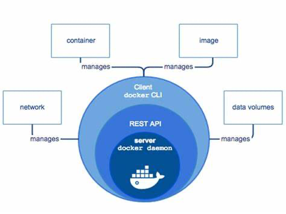

# Spring Bean Lifecycle

Instantiate --> Populate Properties --> Call setBeanName of BeanNameAware -->
Call setBeanFactory of BeanFactoryAware --> Call setApplicationContext of ApplicationContestAware --> Preinitialization (Bean PostProcessors) -->
afterPropertiesSet of Initializing Beans --> Custom Init Method --> Post Initialization (BeanPostProcessors) --> Bean ready to use


When the container is shutdown
Container Shutdown --> @PreDestroy annotated Method --> Disposable Bean's destroy() --> Terminated


* [Tutorials point](https://www.tutorialspoint.com/spring/spring_bean_life_cycle.htm)
* [Geeks For Geeks](https://www.geeksforgeeks.org/bean-life-cycle-in-java-spring/)

Spring has 14 'Aware' interfaces. These are can be useful when you want to modify Spring framework.

### Spring Bean Scope

* Singleton (default) - Only one instance of the bean is created in the IoC container
* Prototype - A new instance is created each time the bean is requested
* Request - A single instance per http request. Only valid in the context of the web-aware Spring ApplicationContext
* Session - A single instance per http session. Only valid in the context of the a web-aware Spring ApplicationContext
* Global Session - A single instance per global session. Typically only used in a portlet context. only valid in the
  context of a web-aware Spring ApplicationContext
* Application - bean is scoped to lifecycle of the ServletContext. only valid in the context of the web aware.
* Websocket - scope a single bean definition to the lifecycle of a webscoket . only valid in the context of a web-aware
  Spring ApplicationContext
* Custom Scope - Spring scope are extensible and you define your own scope by implementing spring 'scope' interface. You
  cannot override in the build in Singleton and Prototype Scope

#### Declaring Bean Scope

* No declaration needed for singleton scope
* in Java Configuration use @Scope annotation
* in XML configuration scope in an xml attribute of the bean tag
* 99% of the time singleton scope is fine

### Setting External Properties

* Command Line Arguments
* SPRING_APPLICATION_JSON
* JNDI
* OS Environment variables
* Property files / YAML (most comnon)

#### Property Hierarchy

- Review Section 24 - Externalized Configuration of Spring Boot
- Properties can be overridden depending on how they are defined
- Lowest are properties defined in JAR/WAR properties or YAML files
- NExt are external properties files to JAR via file system
- Higher are profile specific properties files (in jar then external)
- OS Environment Variables
- Java System properties
- JNDI
- SPRING_APPLICATION_JSON
- Command line argument
- Test Properties (for testing)

## JPA

- Hibernate 5 is complying with JPA 2.1

### JPA Cascade Type

By default, no operation are cascaded.

* PERSIST: Save operations will cascade to related entities
* MERGE: related entities are merged when the owning entity is merged
* REFRESH: related entities are refreshed when the owning entity is refreshed
* REMOVED: removes all related entities when the owning entity is deleted
* DETACH: detaches all related entities if a manual detach occurs
* ALL: Applies all the above cascade options

### Embeddable Type

* JPA/Hibernate do support an embeddable tpes and this is basically a POJO
* There are used to define a common set of propertie. e.g. an order might have a billing address and a shipping address
* An embeddable type could be used for the address properties.

#### Inheritance

Hibernate supports inheritance by using 'MappedSuperClass' . A database table is NOT created for the super class.

* Single Table: (Hibernate Default) - One table is used for all subclasses
* Joined Tables: Based class and subclasses have their own tables. Fetching subclass entities require a join to the
  parent table
* Table Per Class: Each subclass has its own table

#### Create and update Timpestamp

* Often a best practice to use create and update timestamps on your entities for audit proposes
* JPA supports @PrePersist and @PreUpdate which can be used to support audit timestamps via JPA lifecycle callbacks
* Hibernate provides @CreationTimestamp and @UpdateTimestamp (This is hibernate specific)

#### Hibernate DDL Auto

* DDL = Data Definition Language
* DML = Data Manipulation Language
* Camel naming will be changed with "_" . for example : UnitOfMeasure --> unit_of_measure
* Hibernate property in Spring is --> spring.jpa.hibernate.ddl-auto
* Option are none, validate, update, create, create-drop
* Default option for embedded db such as hsql, h2, derby is create-drop , otherwise, it will be 'none' as default.
* Data can be loaded from import.sql
  * This is hibernate not Spring feature
  * Must be on root of the class path
  * You may NEED to add spring.jpa.defer-datasource-initialization=true property into application.properties
* Only executed if hibernate's ddl-auto property is set to create or create-drop

#### Spring JDBC

* Spring's DataSource initializer via Spring Boot will be default load schema.sql and data.sql from the root of the
  classpath
* Spring Boot will also load from scheam-${platform}.sql and data-${platfor}.sql
  * Must set spring.datasource.platform property
* May conflict with Hibernate's DDL Auto property
  * Should use setting of 'none' or 'validate' 

# Testing In Spring

Pleas check 'RecetteProject' for different test style .
Also, in 'Gargamel Pet Clinic' you can fine the upgrading JUnit5

## Testing Terminology

* TDD - Test Driven Development - write test first, which will fail , then code to 'fix' test
* BDD - Behaviour Driven Development - Builds on TDD and specifies that tests of any unit of software should be
  specified in term of desired behaviour of the unit
* Mock - A face implementation of a class used for testing. Like a test double
* Spy - A partial mock, allowing you to override select methods of a real class

## Test Scope Dependencies

Using spring-boot-starter-test (default from Spring Initalizr will load the following dependenciese)

* JUnit - De-facto standard for unit testing java application
* Spring Test and Spring Boot Test - utilities and integration test support for Spring Boot applications
* AssertJ - A fluent assertion of matcher objects
* Hamcrest- A library fo matcher objects
* Mockito - A Java mocking framework
* JSONassert - An assertion library for JSON
* JSONPath - XPath for JSON

## JUnit 4 Annotation

| Annotation                            | Description                                                                                                                              |
|---------------------------------------|------------------------------------------------------------------------------------------------------------------------------------------|
| @Test                                 | Identiies a method as a test method                                                                                                      |
| @Before                               | Executed before each test. It is used to prepare  the test environment (e.g. read inputdata, initialize the class)                       |
| @After                                | Extecuted after each test. It is used to cleanup the test environment. It can also save memory by cleaning up expensive memory structure |
| @BeforeClass                          | Executed once, before the start of all tests. Methods marked with this annotation need to be defined as static to work with JUnit        |
| @AfterClass                           | Executed once, after all tests have been finished. Methos annotated with this annotation need to be defined as static to work with JUnit |
| @Ignore                               | Marchs that the test should be disabled                                                                                                  |
| @Test(expected =<br/> Exception.class | Fails if the method does not throw the named exception                                                                                   |
| @Test(timeout = 10)                   | Fails if the method takes longer than 10 milliseconds                                                                                    |

## Spring Boot Annotations

| Annotation                   | Description                                                             |
|------------------------------|-------------------------------------------------------------------------|
| @RunWith(SpringRunner.class) | Run test with Spring context                                            |
| @SpringBootTest              | Search for Spring Boot Application for configuration                    |
| @TestConfiguration           | Specify a Spring configuration for your test                            |
| @MockBean                    | Inject Mockito Mock                                                     |
| @SpyBean                     | Inject Mockito Spy                                                      |
| @JsonTest                    | Create a Jackson or Gson object mapper via Spring Boot                  |
| @WebMvcTest                  | Used to test web context w/o a full http server                         |
| @DataJpaTest                 | Used to test data layer with embedded database                          |
| @JdbcTest                    | Like @DataJpaTest, but does not configure entity manager                |
| @DataMongoTest               | Configures an embedded MongoDB for testing                              |
| @RestClientTest              | Creates a mock server for testing rest clients                          |
| @AutoConfigureRestDocks      | Allows you to use Spring Rest Docs in tests, creating API Documentation |
| @BootStrapWith               | Used to configure how the TestContext is bootstrapped                   |
| @ConextConfiguration         | Used to direct Spring how to configure the context for the test         |
| @ContextHierarchy            | Allows you to create a context hierarchy with @ConextConfiguration      |
| @ActiveProfile               | Set which Spring Profiles are active for the test                       |

## JUnit 5

| JUnit4       | Junit5      |
|--------------|-------------|
| @Before      | @BeforeEach |
| @After       | @AfterEach  |
| @BeforeClass | @BeforeAll  |
| @AfterClass  | @AfterAll   |
| @Ignore      | @Disabled   |
| @Catgory     | @Tag        |

Please note still you can run Junit 4 or 3 in Junit 5.
Junit 5 needs Java 8 or higher

# Data Binding in Spring

* Command Objects aka Backing Beans : Are used to transfer data to and from web forms
* Spring will automatically bind data of form posts
* Biding done by property name (less 'get'/ 'set')
* Example of a 'PersonBean'
  * 'firstNAme' would bind to property firstName
  * 'address.addressLine1' would bind to the addressLine1one of the address property of the PersonBean
  * email[0]/email[1] would bind to index zero and one of the email ist of Set property of Person

# Handling Exception in Spring framework

## HTTP Status Codes

* HTTP 5XX Server Error (e.g. HTTP 500 is Internal Server Error)
* Other 500 errors are generally not used with Spring MVC
* HTTP 4XX Client errors - Generally Checked exception
  * 400 Bad Request - cannot process due to client error
  * 401 Unauthorized - Authentication required
  * 404 Not found - Resource not found
  * 405 Method not allowed - HTTP method not allowed
  * 409 - conflict - Possible with simultaneous updates
  * 417 Expectation failed - Sometimes used with RESTful interfaces
  * 418 - I'm a teapot - April fools joke from IETS in 1998

## Spring for exception handling

* @ResponseStatus - Allow you to annotate custom exception classes to indicate to the framework the HTTP status you want
  retured when that exception is throw. It is 'global' to the application
* @ExceptionHandler - it works at the controller level and it allows you to define custom exception handling:
  * can be used with @ResponseStatus for just returning a http status
  * can be used to return a specific view
  * also can take total control and work with the model and view
    * 'Model' cannot be a parameter of an ExceptionHandler method
* HandlerExceptionResolver - it is an interface you can implement for custom exception handling
  * Used internally by Spring MVC
  * Note 'Model' is not passed
    * Example:
      public interface HandlerExceptionResolver {
      @Nullable
      ModelAndView resolveException( HttpServletRequest request,
      HttpServletResponse response, @Nullable Object handler, Exception ex );
      }
* Internal Spring MVC Exception Handlers
  * Spring MVC has 3 implementations of HandlerExceptionResolver
    * ExceptionHandlerExceptionResolver - matches uncaught exceptions to @ExceptionHandler
    * ResponseStatusExceptionResolver - looks for uncaught exceptions matching @ResponseStatus
    * DefaultHandlerExceptionResolver - Convert standard Spring Exception to HTTP status codes ( Internal to Spring MVC)
* Custom HandlerExceptionResolver
  * You can provide your own implementations of HandlerExceptionResolver
  * Typically implemented with Spring's Ordered Interface to define order the handlers with run in
  * Custom implementations are uncommon due to Spring robust exception handling
* SimplMappingExceptionResolver
  * A Spring Bean you can define to map exceptions to specific views
  * You only define the exception class name ( no package ) and the view name
  * You can optionally define a default error page

### Which to use them

    * Depends on your specific needs
      * if just setting the HTTP status - use @ResponseStatus
      * if redirection to a view , use SimpleMappingExceptionResolver
      * if both , consider @ExceptionHandler on the controller

## Data Validation with JSR-303

### Built in contraint definitions

* @Null - check value is null
* @NotNull - check values is not null
* @AssertTrue - value is true
* @AssertFalse - value is false
* @Min - Number is equal or higher
* @Max - Number is equal or less
* @DecimalMin - value is larger
* @DecimalMax - value is less than
* @Negative - values is less than zero - zero invalid
* @NegativeOrZero - values is less than zero or zero
* @Positvie - value is greater than zero , zero is invalid
* @PositiveOrZero - value is greater than zero or zero
* @Size - checks if string or collection is between a min and max
* @Digits - checks for integer digits and fraction digits
* @Past - checks if date is in past
* @PastOrPresent - checks if date is past or present
* @Future - checks if date is in future
* @FutureOrPresent - checks if date is present or in future
* @Pattern - checks against RegEx pattern
* @NotEmpty - checks if value is not null nor empty (whitespace chars or empty collections)
* @NonBlank - checks string is not null nor whitespace character
* @Email - checks if the string value is an email address

### Hibernate validation constraints ( These specific for Hibernate and not bean validation)

* @ScriptAssert - class level annotation , check class against script
* @CreditCardNumber - verifies value is a credit card number
* @Currency - value currency amount
* @DurationMax - Duration less than given value
* @DurationMin - Duration greater than give value
* @EAN - Valud EAN Barcode
* @ISBN - valud ISBN Value
* @Length - String length b/w given min and max
* @CodePointLength - validates that code point length of the annotated char sequence is b/w min and max included
* @LuhnCheck - Luhn check sum
* @Mod10Check - Mod 10 check sum
* @Mod11Check - Mod 11 check sum
* @Range - check if number is b/w given min and max ( inclusive)
* @SafeHtml - check for safe HTML
* @UniqueElements - checks if collection has unique elements
* @Url - check for valid URL

## Internationalization

### Local Detection

* Default behaviour is to use Accept-language header
* Can be configured to use system, a cookie, or a custom parameter
* Custom Parameters is useful to allow user to select language

### Local Resolver

* AcceptHeaderLocalResolver is the Spring Boot Default
* Optionally can use FixedLocaleResolver ( uses the locale of the JVM)
* Available: CookieLocaleResolver, SessionLocaleResolver ( Not used much)

### Changing Locale

* Browsers are typically tied to the Locale of the OS
* Locale changing plugins are available
* Spring MVC provides as
  * LocaleChangeIntercepter to allow you to configure a custom parameter to use to change the locale.

### Resource Bundles

* Resource bundles (aks messages.properties) are selected on highest match order.
* First selected wil be on language region (ie: en-US would match messages_en_US.properties)
* If no exact match is found, just the language code is used
* en-GB would match message_en.properties
* OR if no file found, would match messages_en.properties
* Finally would match messages.properties

****

# Docker

### What is it?

* Docker is a standard for Linux containers. In other words, it is an engine that enables any payload to be encapsulated
  as a
  lightweight, portable, self-sufficient container that can be manipulated using standard operations and run
  consistently on virtually
  any hardware platform.
* A "Container" is an isolated runtime inside of Linux
* A "Container" provides a private machine like space under Linux
* Containers will run under any modern Linux Kernel

### Container can:

* Have their own process space
* Their own network interface
* 'Run' processes as root (inside of container)
* Have their own disk space (can share with host too)
* Container is NOT a VM (VM is using Hypervisor)

### Docker terminology

* Docker Image: ``` The representation of a Docker Constainer. Kind of like a JAR or WAR file in Java```
* Docker
  Container: ``` The standard runtime of Docker. Effectively a deployed and running Docker Image. Like a Spring Boot Executable JAR```
* Docker Engine: ``` The code which managees Docker stuff. Creates and runs Docker Containers```
* Docker Engin Runtime



### Docker Editions

For learning more
check [https://www.geeksforgeeks.org/docker-community-edition-vs-enterprise-edition/](https://www.geeksforgeeks.org/docker-community-edition-vs-enterprise-edition/)

#### Docker Enterprise

* CaaS (Container as a Service) platfor subscription
* Enterprise class support
* Quarterly Releases
* Backported patches for one year
* Certified Infrastructure

#### Docker Community

* Free Docker edition for developers and operations
* Monthly 'edge' release with the latest features for developers
* Quarterly releases for operations

#### Why two Docker Editions

* Docker has enjoyed explosive growth over the last several years
* The EE allows Docker of offer certified software and enterprise support
* This is important to companies with mission critical application
* It is important for regulatory compliance (PCI, SOX, SAS-70...)

#### Which Edition for Java Developer

* Functionally, the two editions are the same (Like CentOS vs Red Hat Enterprise Linux)
* Generally, Java developers should be fine using the Docker Community Edition
* Docker EE is not available on some commercial OS such as RHEL or SUSE

#### What is Docker Hub

* Docker hub is a public Docker Registry. It has a lots of images , so I can download them, when it is needed.
* Its address is [https://hub.docker.com](https://hub.docker.com)
* To download any image, I need to run in this way (This example is for MySql)
  ``` sudo docker pull mysql ```
* example of running mongo with exposed port ``` docker run --name my_mongo2 -p 27017:27017 -d mongo``` . In this
  example -p is exposing the tcp port
* another example is for
  mysql ``` sudo docker run --name mysql -v /usr/mysql_temp:/var/lib/mysql -e MYSQL_ALLOW_EMPTY_PASSWORD=yes -p 3306:3306 -d mysql:latest  ``` .
  for my own project I can
  run `` sudo  docker run -p 8081:8080 -d recette ``
* for stop the docker
  * run 'docker ps' to find out the container ID name
  * run 'docker stop [container_id_name]'
* for checking the log for any container

``` 
docker ps 
docker logs [container_id]
 ```

* To build an image using Docker file run: ``` docker build . -t <tag_nmae>``` . An
  example ` sudo docker build . -t recette -f recette.dockerfile `
* I can copy the file like ` scp -P 222 ./RecetteProjet-0.0.1-SNAPSHOT.jar USERNAME@192.168.XXX.XXX:/usr/docker/.  `
* In order to have a shell environment for the docker use ``` docker exec -it <container_name> bash```
* In order to use a volume in command line for docker ``` docker run -v <host_path>:<the_container_path> <image_name>```
* Sample of dockerfile (recette.dockerfile)

``` 
FROM openjdk:17-alpine

ADD RecetteProjet*.jar recette.jar
CMD java -jar recette.jar
```

#### What is a Docker Image

* An image defines a Docker Container (Similar in concept to a snapshot of a VM or a class vs an instance of the class)
* Images are immutable. That means, once built, the files making up an image do not change
* Image are built in layers
* Each layer is an immutable file, but is a collection of files and directories
* Layers receive an ID, calculated via a SHA 256 hash of the layer contents
* Thus, if the layer contents change, the SHA 256 hash changes also.

### Image IDs

* image ids are a SHA 256 hash derived from the layers. Thus if the layers of the image changes, the SHA 256 hash
  changes
* The image ID listed by docker command (ie: docker images / docker images -q --no-trunc) is the first 12 characters of
  the hash

#### Image Tag names

* I can use image tag name
* the values of images are referred to by 'tag' names (this concept is very confusing at first)
* the format of the full tag name is ```[REGISTRYHOST/][USERNAME/]NAME:TAG```
  * REGISTERYHOST : registry.hub.docker.com
  * TAG: 'latest' is default
  * e.g registry.hub.docker.com/mongo:latest

#### How to use resistant storage

* when I want to run the docker I can use '-v [PATH]' (-v is for volume) to specify where docker can put the storage
  file there.
* example :

```
docker run --name my_mongo -v /user/temp:/data/db -d mongo:tag
```

In this example with add ':' , I change the path of real path to the one I want to give to mongo to used it. which
means, mongo understand the path as /data/db

### Docker House Cleaning

* There are three key areas of house keeping
  * Containers
  * images
  * volumes

#### Docker commands for house cleaning containers

* Kill all running docker containers
  ``` docker kill $(docker ps -q) ```
* Delete all Stopped Docker containers ```
  docker rm $(docker ps -a -q) ```
* Remove a dokcer image ```
  docker rmi \<image name\> ```
* delete untagged (dangling) images ```
  docker rmi $(docker images -q -f dangling=true) ```
* Delete all images ```
  docker rmi $(docker images -q) ```

#### Docker commands for house cleaning volumes

* One a volume is no longer associated with a container it is considered as 'dangling'
* Remove all dangling volumes ```
  docker volume rm $(docker volume ls -f dangling=true -q)
  Note: This command does not remove files from host system in shared volumes ```
* Cheat
  sheet [docker-cheat-sheet-for-spring-devlopers](https://springframework.guru/docker-cheat-sheet-for-spring-devlopers/)

### Running Spring in Docker

* to run command ``` sudo docker run -v /usr/tmp:/usr/share/misc -d openjdk:17-alpine tail -f /dev/null``` to keep the
  centos up and running
* note that running command ` sudo docker ps` will not show the centos container in the list
* now if you run `sudo docker exec -it <image_name> sh` you can inside of alpine with java 17 and run any application
  you want.
* for example I can run `java -version`

# MySQL

* It is RDBMS database which has ACID compliance
  * A: Atomicity - all or nothing
  * C: Consistency - transactions are valid to rules of the DB
  * I: Isolation - Result of transactions are as if they are done end to end
  * D: Durability - Once a transaction is commited, it remain so

## Features

* Stored Procedure
* Triggers
* Cursors
* Updatable views
* Query Caching
* Subselects

## DataType

MySql does not support standard ANSI SQL for data type
Data Type categories in MySQL:

* Numeric Data Types
  * INTEGER/INT (4b)
  * TINYINT (1b)
  * SMALLINT (2b)
  * MEDIUMINT (3b)
  * BIGINT (8b)
  * FLOAT (4b)
  * DOUBLE (8b)
  * DECIMAL/NUMERIC (Length + 1 or 2 bytes)
* Date and Time Data Types
  * DATE (3b)
  * DATETIME (8b)
  * TIMESTAMP (4b)
  * TIME (3b)
  * YEAR (1b)
* String Data Types
  * CHAR - Length (0 - 255 bytes) - (DB will pad spaces to the end of the string)
  * VARCHAR - Length +1 - variable string
  * BINARY - Length - Similar to CHAR
  * VARBINARY - Length +1
  * BLOB - Length + 2 to 4 bytes
  * TEXT - Length + 2
  * ENUM (1-2 bytes)
  * SET (1-8 bytes)
* Spatial Data Types
* JSON Data Types (JavaScript Object Notation)
  * This is complex, structured document containing properties and values
  * Storage for JSON data types is similar to BLOB and TEXT data types.
  * MySQL converts the JSON to an internal format for optimized storage and searching
  * MySQL support searching of JSON document properties
  * MySQL allows you to update portions of a JSON document(no replace needed)

## Types of connections

* Local Connection - This is when you are using command line on the machine running MySQL
* Remote/Client Connection - You are using some type of client software on the same machine
  OR connect to the MySQL Server from different machine over the network
  Client Protocol
  * TCP/IP - Most common
  * Socket (Unix/OSX/Linux)
  * PIPE (Windows Only)
  * MEMORY (Windows Only)

# MongoDB

* MongoDB is a document oriented database
* It is a NOSQL database written with C++
* MongoDB documents are storted in BSON (Binary JSON)

#### Why to use MongoDB

* MongoDB is greate for high insert systems (sensor reading, social media, advertising systems)
* Good when you need schema flexibility
* It can also support a high number of reads pe second

#### Why not to use MongoDB

* MongoDB has no concept of transactions
  * No ACID
  * No locking for transactional support, hence faster inserts
* Not good for concurrent updates
* if you have RDMS and want to change to NoSQL, no bi-directional relationship works anymore.

### MongoDB Terminology

| RDMS        | MongoDB              |
|-------------|----------------------|
| Database    | Database             |
| Table       | Collection           |
| Row         | Document             |
| Column      | Field                |
| Table Join  | Embedded Documents   |
| Primary Key | Primary Key          |
| Aggregation | Aggregation Pipeline |

# Spring Reactive Programming

* [www.reactivemanifesto.org](www.reactivemanifesto.org)
* Reactive System from architecture and design (cloud Native)
* Reactive Programming is generally event based
* Functional Reactive programming (FRP) often confused with Reactive Programming

## Reactive Manifesto

* Responsive
* Elastic
* Resilient
* Message Driven

## Reactive Programming w/ Reactive Systems

* Reactive Programming is a useful implementation technique
* Reactive Programming focuses on non-blocking, asynchronous execution - a key characteristic of Reactive Systems
* Reactive Programming is just one tool in building Reactive Systems

## What is Reactive Programming

* It is an asynchronous programming paradigm focused on streams of data
* Reactive Programming focuses on processing streams of data
* Traditional CRUD applications are still alive and well
* it also maintain a continous interaction with their environment , but at a speed which is determined by the
  environment, not the program itself.
* it is interactive programs work at their own pace and mostly deal with communication, while reactive programing only
  work in response to external demands and mostly deal with accurate interrupt handling.
* SpringMVC (@Controller / @RequestMapping) and Spring WebFlux(Router Functions) are completely two different component
  in Spring framework
* Real-time programs are usually are reactive
* Common use cases
  * external service calls
  * high concurrent message consumers
  * spreadsheets
  * abstraction over asynchronous processing

### Features of Reactive Programming

* Data Streams
  * It can be just about anything
  * mouse click or other user interactions
  * JMS messages , RESTful Services calls, Twitter feed, Stock Trades, List of data from a database
  * A Stream is a squence of events ordered in time
  * Event you want to listen to
* Asynchronous
  * Events are captured asynchronously
  * A function is defined to execute when an event is emitted
  * Another function is defined if an error is emitted
  * Another function is defined when complete is emitted
* Non-blocking
  * It is similar to GoF Observer Pattern
  * It is an important feature (act similar to Node.js)
  * In Blocking, the code will stop and wait for more data (ie reading from disk , network, ...)
  * Non-Blocking in contrast, will process available data, ask to be notified when more is available, then continue
* Backpressure
  * The ability of the subscriber to throttle data
* Failures as Messages
  * Exceptions are not thrown in a traditional sense(would break processing of stream)
  * Exceptions are processed by a handler function

### Spring Reactive Types

* Two new reactive types are introduced with Spring Framework 5
* 'Mono' is a publisher with zero or one elements in data stream
* 'Flux' is a publisher with zero or MANY elements in the data stream
* Both types implement the Reactive Streams Publisher interface

#RESTful Services

## RESTful Web Services

* Because of their simplicity and versatility, RESTful web serves have become the de facto standard for web services
* REST - Representational State Transfer
  * Representational -- Typical JSON or XML
  * State Transfer - Typical via HTTP

## RESTful Terminology

* Verbs: HTTP Methods : GET, POST, DELETE, PUT
* Messages: the payload of the action (JSON/XML)
* URI: Uniform Resource Identifier (A unique string identifying a resource)
* URL: Uniform Resource Locator (A URI with network information e.g. http://www.gforcesoftware.ca)
* Idempotence:
  * Wikipedia: Idempotence is the property of certain operations in mathematics and computer science that they can be
    applied multiple times w/o changing the result beyond the initial application
  * In other words, you can exercise the operation multiple times, without changing the result
  * Example: Refreshing a web page (HTTP GET operation)
* Stateless - Service does not maintain any client state
* HATEOAS: Hypermedia AS The Engine Of Applications State
  * Wikipedia: a REST client should then be able to use server-provided links dynamically to discover all the available
    actions and resources it needs.
    . As access proceeds, the server responds with test that includes hyperlinks to other actions that are currently
    available.

### HTTP GET

* use: to read data from resource
* read only
* idempotent
* state operation - does not change state of resource

| Methode | USE                              | Safe<br/>Operation | Read<br/>Only | Idempotent |
|---------|----------------------------------|--------------------|---------------|------------|
| GET     | read data from resource          | Yes                | Yes           | Yes        |
| PUT     | to insert or update              | No                 | No            | Yes        |
| POST    | Always create new object(Insert) | No                 | No            | No         |
| DELETE  | to delete an object in resource  | No                 | No            | Yes        |

## Richardson Maturity Model (RMM)

* A model used to describe the maturity of RESTful services
* Unlike SOAP there is no formal specification for REST
* RMM is used to describe the quality of the RESTful service

### RMM Levels

```
| Level 3: Hybermedia Control  |
| Level 2: HTTP Verbs          |
| Level 1: Resources           |
| Level 0: The swap of POX     |
```

#### Level 0 - Swamp of POX

* POX - Plain Old XML
* uses implementation protocol as a transport protocol
* typically uses one URI and one kind of method
* Examples RPC, SOAP, XML-RPC

#### Level 1- Resources

* Uses multiple URIs to identify specific resources
* Still uses a single method (e.g GET)
* Example:
  * http://www.gforcesofteare.ca/product/1234

#### Level 2 - HTTP Verbs

* HTTP Verbs are used with URIs for desired actions
* Most common in practical use
* Example:
  * GET /products/1234 - to return data for product 1234
  * PUT /products/1234 - to update data for product 1234
  * DELETE /product/1234 - to delete product 1234

#### Level 3- Hypermedia Control

* Representation now contains URIs which may be useful to consumers (self documenting)
* Helps client developers expolore the resource
* No clear standard at this time
* Spring provides an implementation of HATEOAS

| **Core Technolog** |
|--------------------|
| HYPERMEDIA         |
| HTTP               |
| URI                |

#### Data Model

* Spring by default use Jackson to bind JSON to Java POJOs
* 

